# Project 1.3 — Linux & Windows Security Baseline Lab

**Author:** Chukwunenye Okanumee

**Module:** TSA Cybersecurity Curriculum — Module 1: Foundations of Cybersecurity & Computing
**Environment:** Ubuntu 22.04.5 LTS (VirtualBox), Windows 11 Enterprise LTSC Evaluation (VMware Workstation)
**Objective:** Document default OS configurations, apply targeted security hardening, and verify each control functions as intended across two operating systems.

## Contents

- [Setup](#setup)
- [Linux Phase 1: Security Baseline Assessment](#linux-phase-1-security-baseline-assessment)
- [Linux Phase 2: SSH Hardening](#linux-phase-2-ssh-hardening)
- [Linux Phase 3: Password Complexity](#linux-phase-3-password-complexity)
- [Windows Hypervisor Note and Phase 1: Security Baseline Assessment](#windows-hypervisor-note-and-phase-1-security-baseline-assessment)
- [Windows Phase 2: Password Complexity and Delivery Optimization](#windows-phase-2-password-complexity-and-delivery-optimization)
- [Summary](#summary)

Hi there, in this article I will be taking you through a project where I built a dual-OS home lab: Ubuntu and Windows 11, side by side.

I documented the default configuration of each, then applied real hardening steps: SSH hardening, Linux password complexity, account lockout policy, Windows password complexity.

Seeing "default" vs "hardened" side by side made the gap between them click in a way reading about it never did.

This is going to be exciting. Without any waste of time, let's get started.

## Setup

VirtualBox + Ubuntu 22.04 LTS ISO + Windows 11 (both free)

Two separate VMs, not dual-boot.

## Linux Phase 1: Security Baseline Assessment

I got a fresh Ubuntu OS and captured the clean install. Then I ran the following commands to see the initial baseline assessment of the OS.

### `whoami`

Prints the username you're currently logged in as. This is usually the first command an attacker runs upon gaining access to a shell. As an auditor, you run this to confirm that you are logged in on the correct account. In this case, I am logged in as nenyeokanumee.

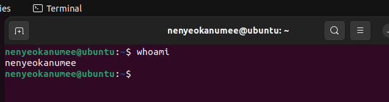

### `id`

Shows your user ID (UID), group ID (GID), and every group you belong to. This is important because the groups that you belong to determine the kind of access you get. For instance, the sudo group provides privileged access for admins. If you are not an admin but in the sudo group, that is a privilege escalation risk. On a clean Ubuntu install, the initial user comes with sudo access, as in this one (27(sudo)).

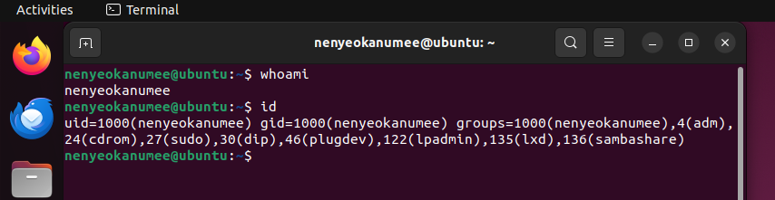

### `cat /etc/passwd`

This displays all the accounts on the system, including system or service accounts. As an analyst, you scan for accounts that should not exist, and for accounts with a login shell (`/bin/bash`) when they should have `/usr/sbin/nologin`. Service accounts should not be able to log in interactively; if they can, that is a finding.

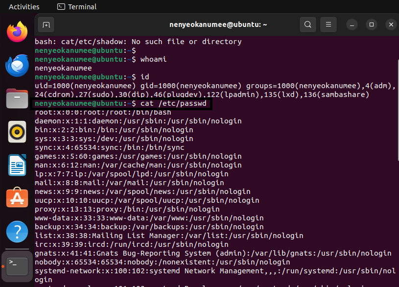

Note: the `x` means the password hash lives elsewhere (in `/etc/shadow`), not in the passwd file. Also note that root has `/bin/bash` (root needs an interactive shell). Every service account (daemon, bin, sys, www-data, etc.) has `/usr/sbin/nologin`. That's the finding: service accounts are correctly barred from interactive login. If any of those showed `/bin/bash` instead, that'd be a real hardening gap.

### `ls -la /etc/shadow`

This command lists the file *metadata* (permissions, owner, size, date) on the specified directory or file. In this case, the owner, root, has read and write privileges to the shadow file. Other users in the same group as root also have read-only access, while others who do not have root privileges have neither read nor write access.

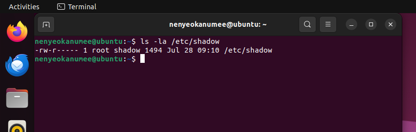

### `uname -a`

This command prints kernel version and system architecture info. This is important because the kernel version tells you whether the system is vulnerable to known kernel-level CVEs. Patch management starts with knowing what version you're running. From the picture here, you will see that this Ubuntu is version 22.04.

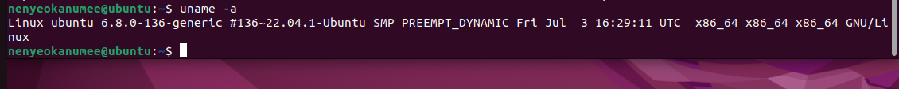

### `netstat -tulnp`

This command lists every port the machine is listening on. Every open port is a potential entry point for attackers.

Flags: `-t` = TCP, `-u` = UDP, `-l` = listening only, `-n` = show numeric ports, not service names, `-p` = show the process using each port (needs sudo to see process names for other users' processes).

`systemd-resolve` on 127.0.0.53:53 (local DNS stub, not externally exposed), `cupsd` on 631 (print service, IPv4/IPv6 loopback), `avahi-daemon` on 5353/49260 (mDNS service discovery). A fresh Ubuntu Desktop install has zero services listening on an externally reachable interface. Everything's bound to loopback or link-local. The default attack surface on this baseline is minimal.

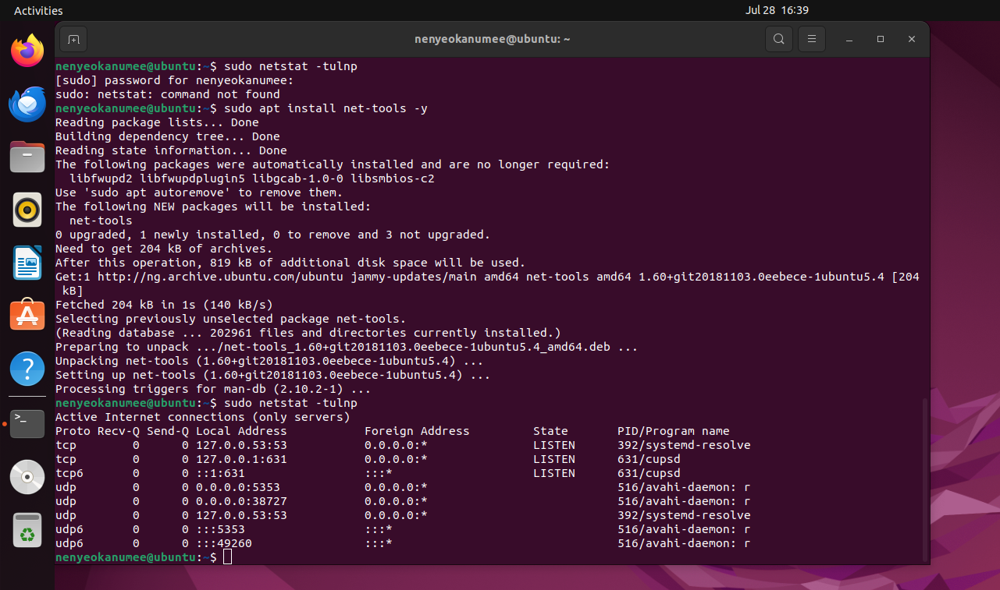

From this command, you will notice that port 22 was not on the listener list. This means SSH is not installed on this machine. Only Ubuntu Server comes with SSH installed. So, in Phase 2 of this project, we are going to install SSH and harden it.

## Linux Phase 2: SSH Hardening

In this phase, we shall install SSH to demonstrate the hardening step, since the default Desktop install doesn't include it.

### `sudo apt install openssh-server -y`

This command installs openssh-server, which was missing in the initial Ubuntu install.

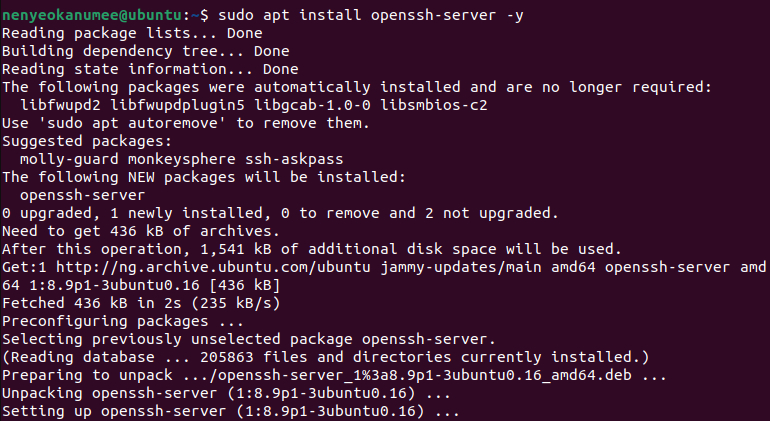

`sudo systemctl enable ssh --now` starts and enables the SSH service we installed.
`sudo netstat -tulnp | grep ssh` shows that SSH is now listed and listening on port 22.
`grep -i permitrootlogin /etc/ssh/sshd_config` searches the sshd_config file for the PermitRootLogin line. This is the line that needs to be edited to harden SSH.

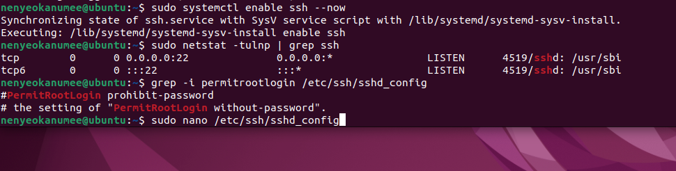

### `sudo nano /etc/ssh/sshd_config`

Find that commented PermitRootLogin line, uncomment/change it to `PermitRootLogin no` (it was `prohibit-password`, meaning root was already restricted to key-only login, not wide open). Then save it.

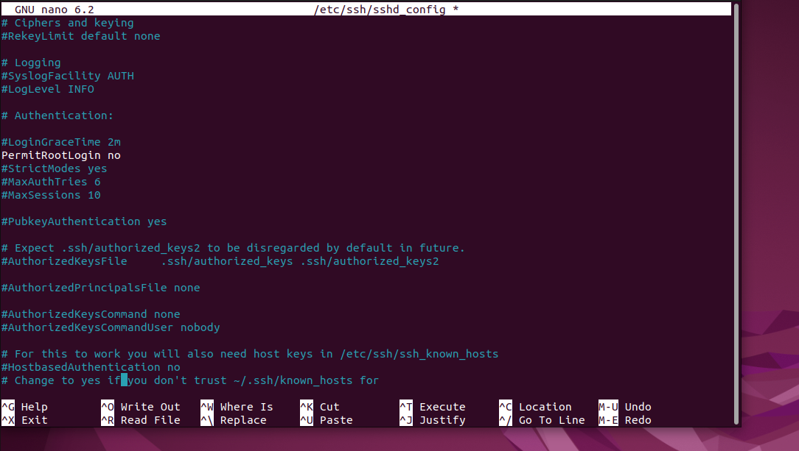

## Linux Phase 3: Password Complexity

In this phase of the project, we shall be enforcing password complexity. The goal is to make sure that passwords meet a particular criterion: at least 12 characters long, containing an uppercase letter, a lowercase letter, a number, and a special symbol. Users have only 3 attempts if they do not know their password.

### `cat /etc/pam.d/common-password`

The common-password file is where password complexity is implemented.

The line `password requisite pam_pwquality.so retry=3` tells us that the user has 3 attempts, but other requirements like uppercase, lowercase, numbers, and special characters are not required. So let's fix that.

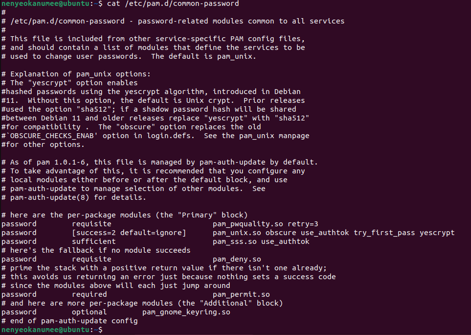

### `sudo nano /etc/pam.d/common-password`

We use the nano command to open the file we want to edit. What we do here is add the other requirements (`minlen=12 ucredit=-1 lcredit=-1 dcredit=-1 ocredit=-1`) to the same line as `password requisite pam_pwquality.so retry=3`. Where `minlen` means minimum length, `ucredit` means uppercase, `lcredit` means lowercase, `dcredit` means digit, and `ocredit` means special character.

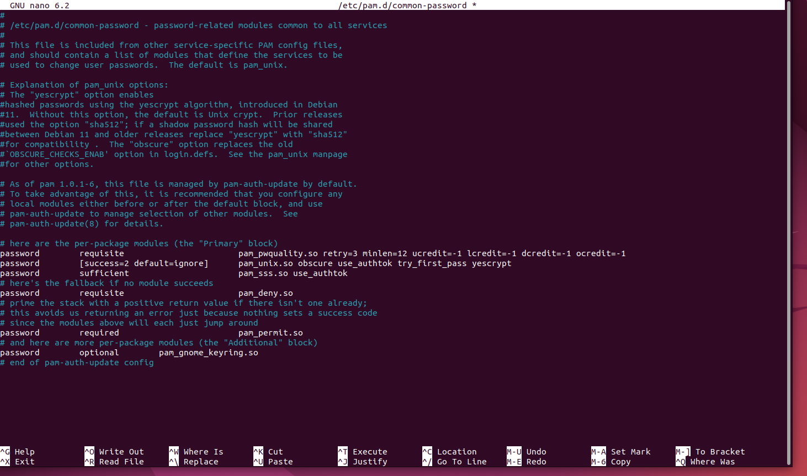

### `passwd`

It doesn't end there; I decided to change my password to something that does not meet these criteria, and it was rejected. It gave me only 3 attempts to try too.

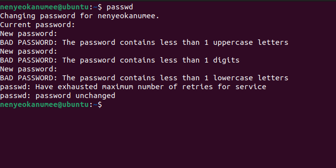

I finally changed my password to something that meets all requirements, and it was accepted.

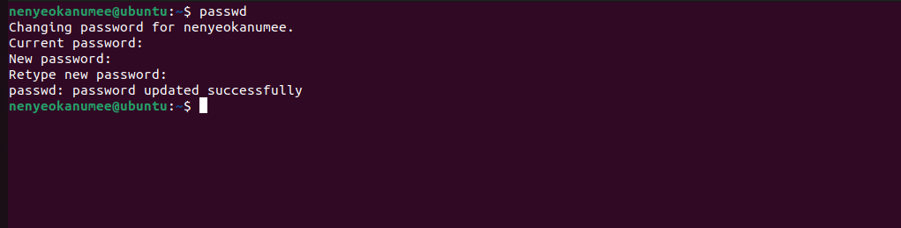

## Windows Hypervisor Note and Phase 1: Security Baseline Assessment

Windows 10 reached end of support on October 14, 2025, meaning it no longer receives security patches. Building a security baseline lab on an EOL OS would misrepresent current best practice, so I used Windows 11 instead to reflect a currently supported system.

Windows 11 failed to install in VirtualBox 7.2.10 across multiple attempts (EFI/TPM/Secure Boot-related failures at various stages of installation). I diagnosed it as a likely VirtualBox TPM 2.0 compatibility issue with Windows 11's hardware requirements. I successfully installed the same ISO on VMware Workstation without modification, confirming the ISO and VM specs were correct. I ran Windows 11 on VMware while the Ubuntu baseline remained on VirtualBox.

### 1. Account inventory: `net users`

Lists every local account. Equivalent of `/etc/passwd` on Linux — check for any account you don't recognize.

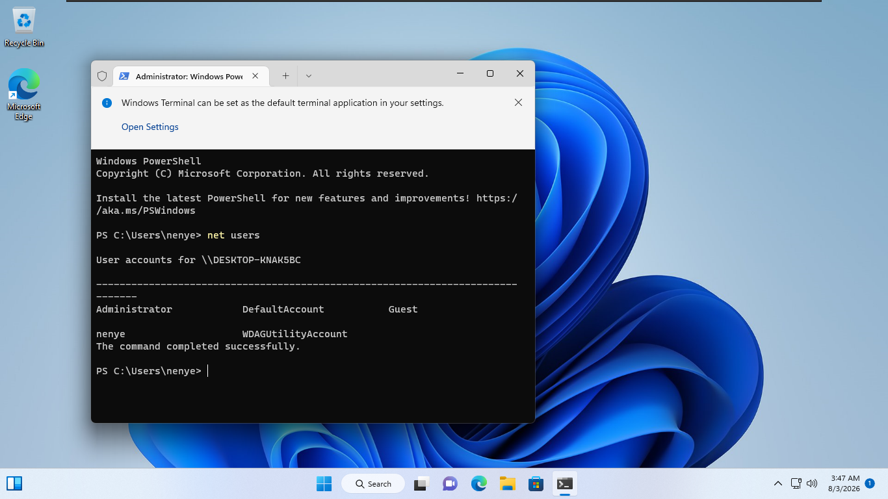
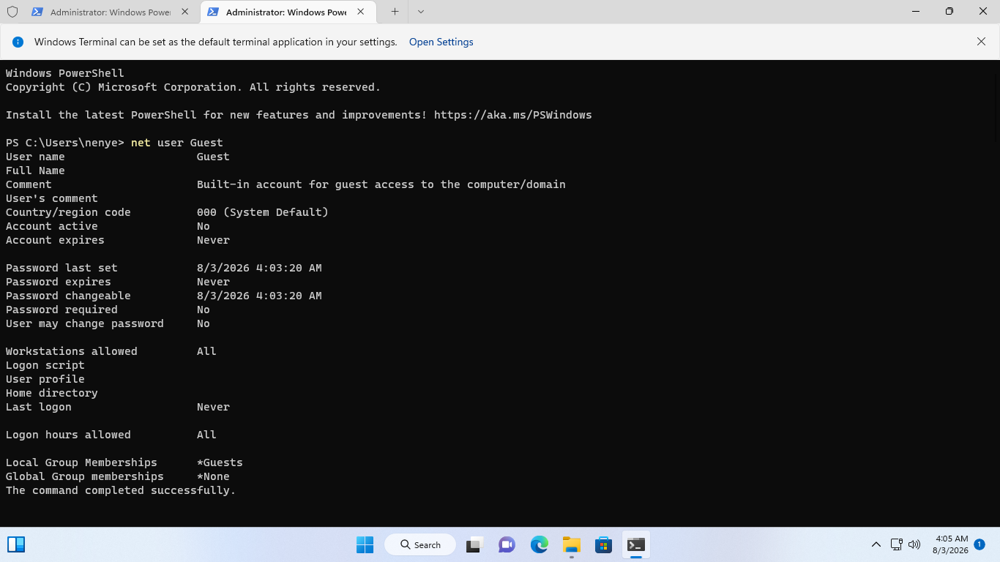
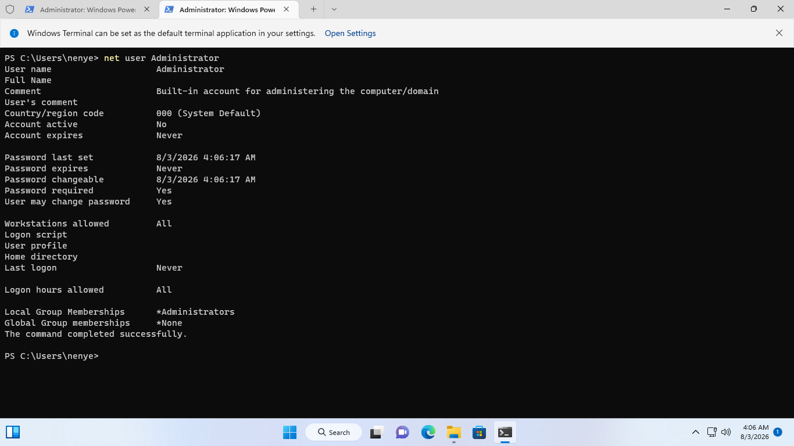
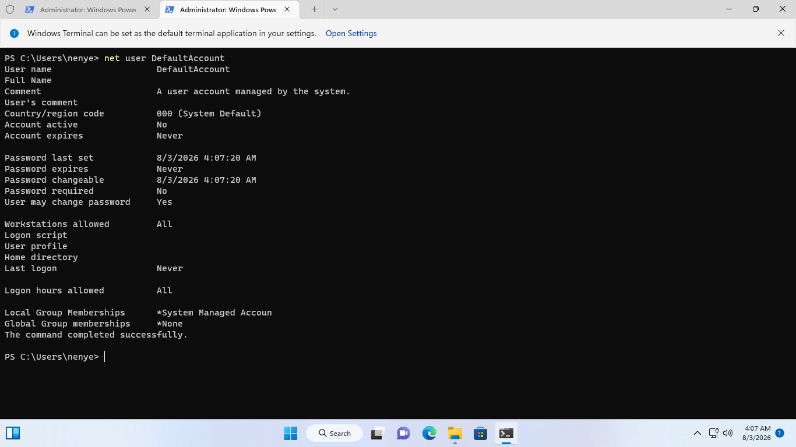

Note from these screenshots: Guest, DefaultAccount, and Administrator are all disabled. This is a good security control, because if any were active by default, that would be a vulnerability, as unwanted persons would be able to log in to the machine.

### 2. Admin group membership: `net localgroup administrators`

Shows exactly who has admin rights. This is your highest-value finding — same logic as checking the `sudo` group membership on Linux, and it's the group `Event ID 4732` tracks changes to.

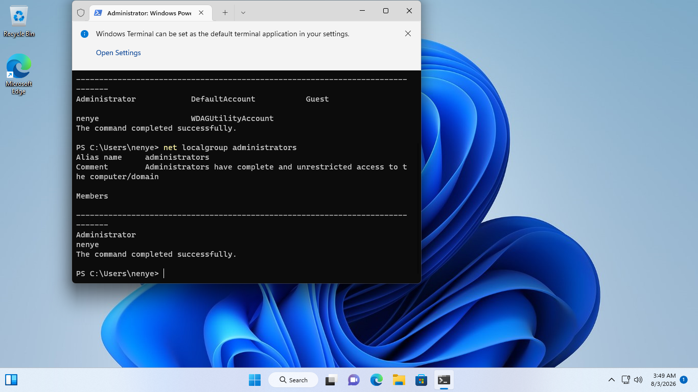

### 3. Listening ports: `netstat -an`

Same purpose as `netstat -tulnp` on Ubuntu — every listening port is an attack surface.

Note: this doesn't show process names by default (Windows `netstat` needs an extra flag for that, `netstat -anb`, but that requires admin rights and can be slow).

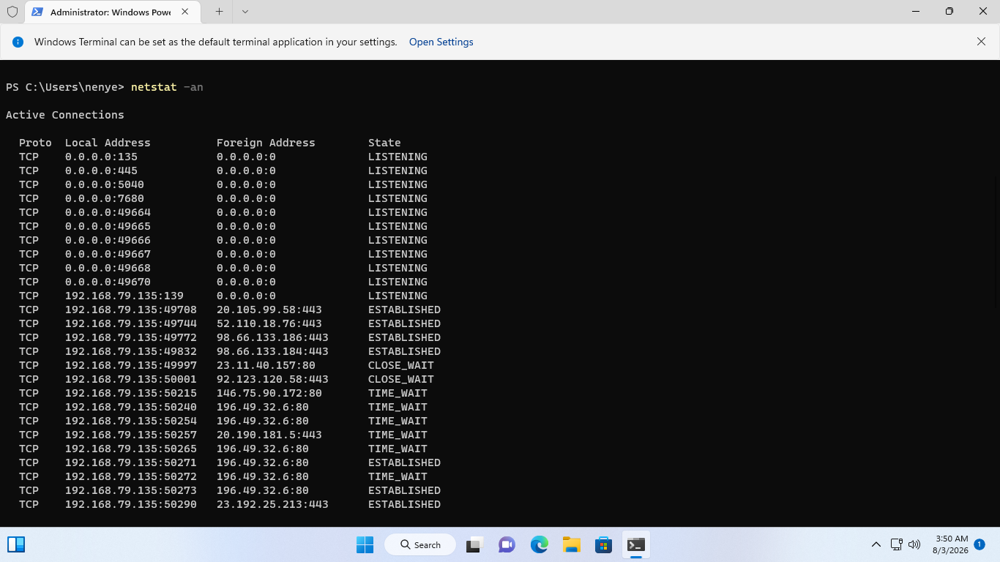

### 4. Running services: `Get-Service | Where-Object {$_.Status -eq "Running"}`

This needs PowerShell specifically, not cmd. Lists every currently active service — same concept as checking what's running on the Linux box, but Windows services are a much larger attack surface by default given how much runs out-of-box.

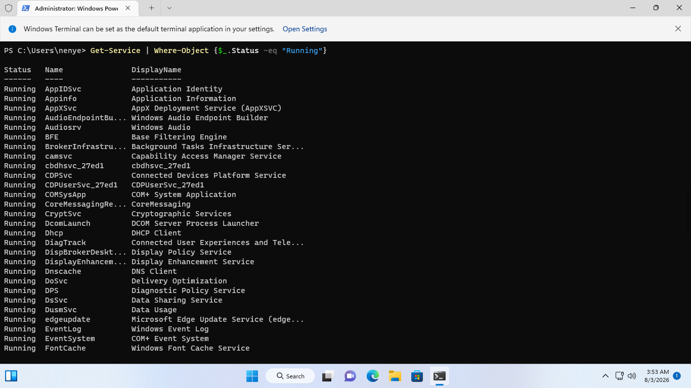
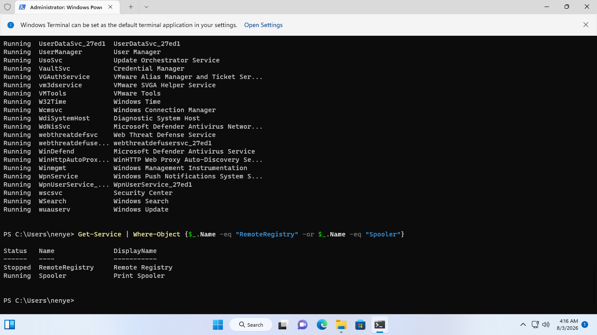

**RemoteRegistry (Stopped)** — a good control, because this service lets someone modify the Windows registry remotely over the network. A huge amount of system configuration and security settings live in the registry, so remote write access to it is a serious risk.

**Spooler (Running)** — needed for the user to be able to print jobs. However, this service was the exploitation vector for **PrintNightmare (CVE-2021-34527)**, a real, well-known vulnerability that let attackers achieve remote code execution through the print spooler.

Even a service you need for legitimate functionality still represents attack surface, and a hardening review should note it as a known historical target rather than ignore it because it's "normal."

Also note that Windows Defender is already running. This is a good control — if it wasn't, we would need to activate it, so no action was needed for Defender.

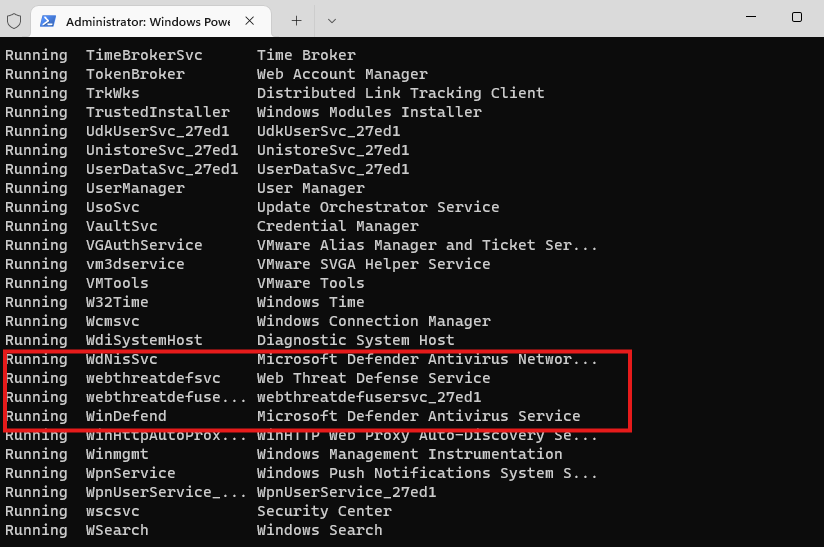

## Windows Phase 2: Password Complexity and Delivery Optimization

Open Local Security Policy: search for it in Windows search, or use `secpol.msc` in either PowerShell or Win+R.

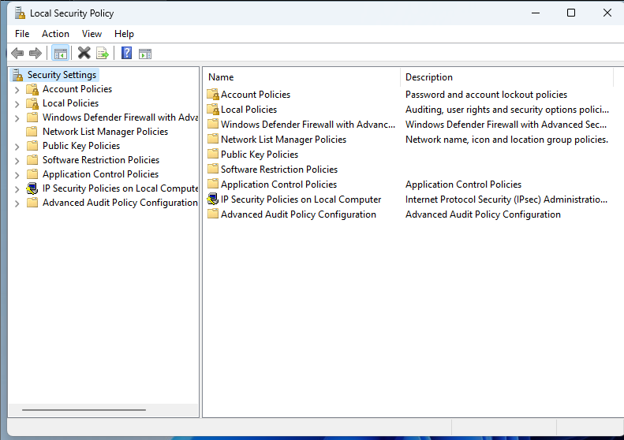

Navigate: **Security Settings → Account Policies → Account Lockout Policy**. You will see Account lockout duration, Account lockout threshold, Allow Administrator account lockout, and Reset account lockout counter after.

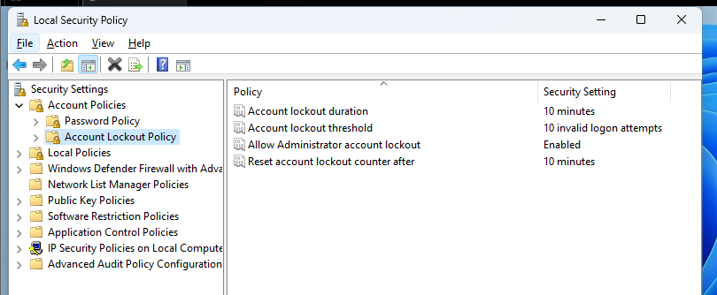

Then set:

- Account lockout threshold: **3** invalid attempts (it was initially **10** invalid logon attempts)
- Windows auto-populates lockout duration and reset counter to 30 minutes each when you set the threshold — accept those defaults unless you want to customize
- Click Apply/OK

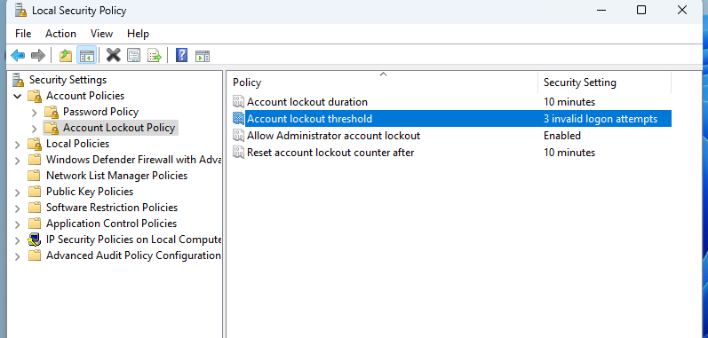

**Account Policies → Password Policy** (right above Account Lockout Policy, same section).

This is what you will find initially:

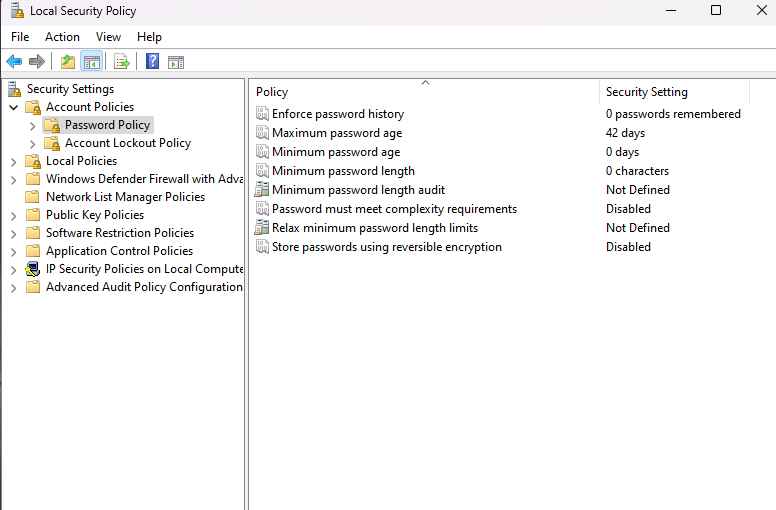

- **Enforce password history** — prevents password reuse
- **Maximum password age** — forces periodic changes
- **Minimum password age** — default 0, no restriction on how soon you can change it again
- **Minimum password length** — default 0 or a low number (varies by build); this is your main complexity lever
- **Password must meet complexity requirements** — the direct equivalent of what was configured with `pam_pwquality` on Linux. Default was **Disabled** on this install; it checks for uppercase, lowercase, digits, and special characters when turned on
- **Store passwords using reversible encryption** — should always be **Disabled**; this is a legacy/compatibility setting that, if enabled, stores passwords in a recoverable format rather than a proper hash. Flag this explicitly if found enabled; it'd be a serious finding

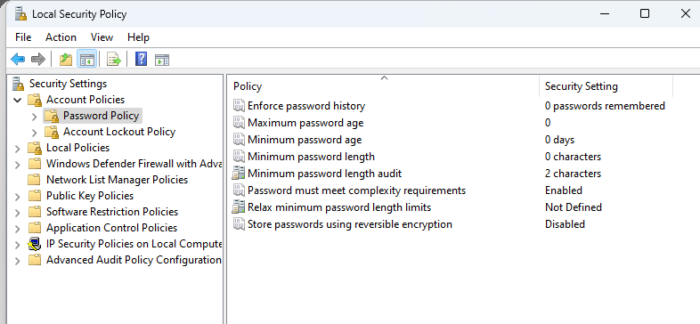

Set **Minimum password length** to **12** characters:

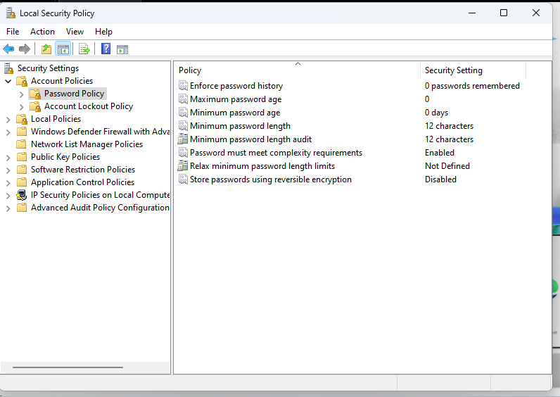

I verified the password policy was actually enforced by testing both sides of it: a password under 12 characters was rejected, and a compliant password (12+ characters, mixed case, a digit, and a special character) was accepted.

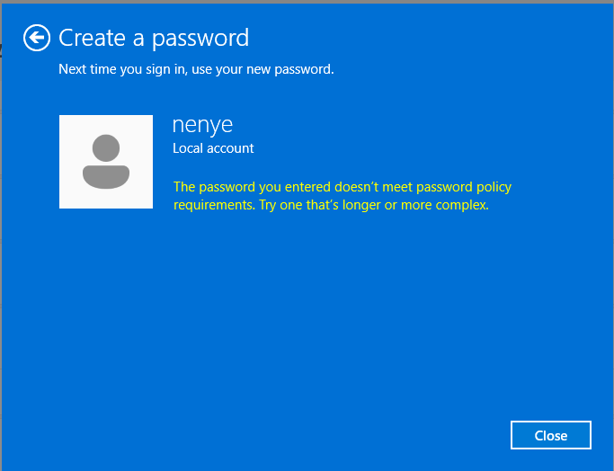
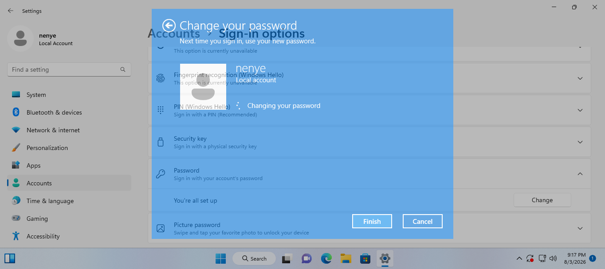

### Delivery Optimization

Go to **Settings → Windows Update → Advanced options → Delivery Optimization**.

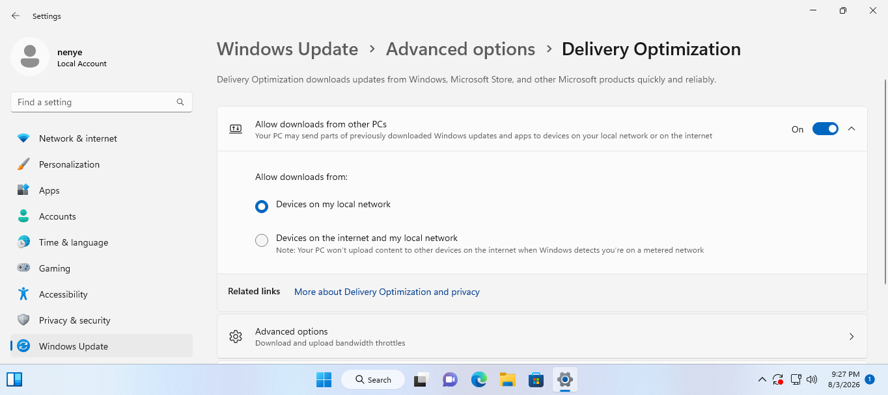

Confirmed Delivery Optimization was already restricted to local-network-only by default; assessed as low risk for a standalone lab environment and left unchanged.

## Summary

In this lab, I compared default and hardened security postures across two operating systems. Ubuntu's default attack surface was minimal, with no externally reachable services, service accounts correctly barred from interactive login, and password/SSH controls that required deliberate hardening (SSH wasn't even installed by default). Windows 11 presented a larger default footprint: dozens of running services and multiple outbound HTTPS connections at idle versus Ubuntu's near-zero external footprint, though several controls I expected to configure — Defender, disabled Guest/Administrator accounts, and local-network-restricted Delivery Optimization — were already correctly set out of the box.

I took real hardening actions: disabling root SSH login and enforcing password complexity on Linux, and raising minimum password length and tightening the account lockout threshold on Windows. Each control was verified functionally, not just configured — rejecting non-compliant passwords and confirming compliant ones succeeded on both systems, and confirming the SSH and lockout policy changes took effect.

Getting to a working Windows 11 VM also required diagnosing a genuine hypervisor compatibility issue: VirtualBox 7.2.10 failed to complete the Windows 11 install across multiple attempts due to EFI/TPM/Secure Boot-related failures, while the identical ISO installed cleanly on VMware Workstation. I isolated the problem to the hypervisor rather than the install media or VM configuration.
