# Wireshark Network Traffic Analysis Lab

## Executive Summary

This report documents the analysis of a NetSupport Manager RAT infection identified via a SIEM alert on 2026-02-28. Using Wireshark, the infected host was traced to IP `10.2.28.88` (`DESKTOP-TEYQ2NR`), user Becka Rolf, communicating with C2 server `45.131.214.85` over a persistent HTTPS connection. Analysis confirmed the malware bypassed DNS by hardcoding its C2 IP and maintained a single long-lived session rather than repeated connections.

This lab captures and analyzes real network traffic using Wireshark against sample PCAP files (one malicious, one benign) and documents the findings. Packet analysis is a daily SOC task; this exercise demonstrates readiness for Tier 1 work.

The malicious capture (`2026-02-28-traffic-analysis-exercise.pcap`, "Easy As 123") was sourced from [Malware Traffic Analysis](https://www.malware-traffic-analysis.net/2026/02/28/index.html) and downloaded inside a Kali Linux VM with the network adapter set to host-only, preventing the VM from communicating with the host system during analysis. The benign capture (`http_with_jpegs.cap`) was sourced from the [Wireshark Sample Captures wiki](https://wiki.wireshark.org/SampleCaptures).

## Scenario/Environment

A SOC alert fired for a **NetSupport Manager RAT** (a real remote-access trojan) communicating with IP `45.131.214.85` on port 443, starting at 19:55 UTC on 2026-02-28.

**Objective:** Find the infected machine in the PCAP.

**Environment facts given:**
- LAN range: `10.2.28.0/24`
- Domain: `easyas123.tech`
- Domain controller: `10.2.28.2` (hostname `EASYAS123-DC`)
- Gateway: `10.2.28.1`

**Five questions to answer:**
1. IP address of the infected Windows client
2. MAC address of the infected Windows client
3. Host name of the infected Windows client
4. User account name on that client
5. Full name of the user tied to that account

## Investigation Findings

### Q1: IP address of the infected machine

Since the malicious traffic originates from `45.131.214.85`, the infected host can be found by filtering for that IP and identifying the internal source address in the conversation.

```
ip.addr == 45.131.214.85
```

**Finding: `10.2.28.88`**

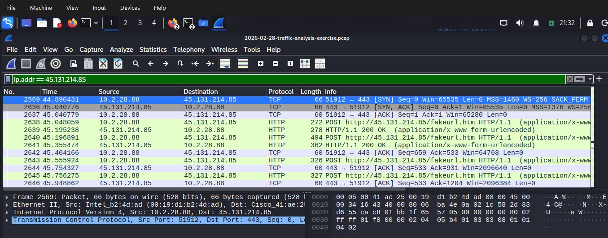

### Q2: MAC address of the infected machine

The MAC address is visible in the Ethernet II header of any packet sourced from the infected IP.

**Finding: `00:19:d1:b2:4d:ad`**

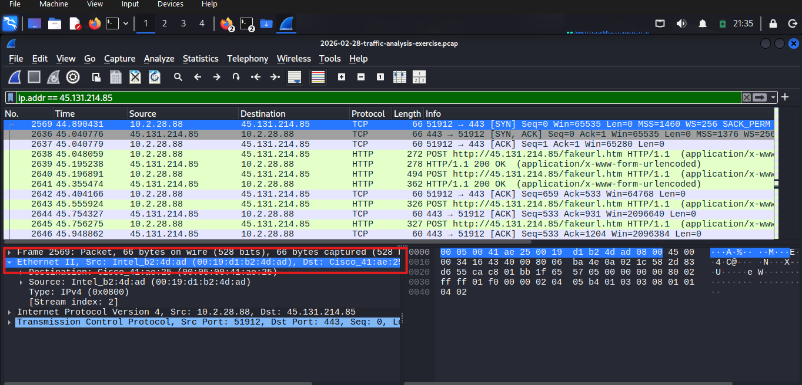

### Q3: Hostname of the infected machine

A workstation's hostname is typically recorded during the DHCP request. Filtering for DHCP and locating the request from the infected IP reveals the Host Name option field.

```
dhcp
```

**Finding: `DESKTOP-TEYQ2NR`**

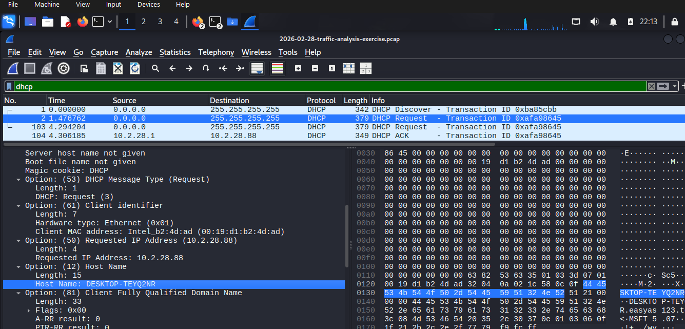

### Q4: User account name on the infected machine

This is an Active Directory environment (`EASYAS123` domain), so the infected machine generates Kerberos authentication traffic. Filtering for an AS-REQ packet sourced from the infected IP and drilling into `req-body → cname → CNameString` reveals the logged-in username.

```
kerberos.CNameString
```

**Finding: `brolf`**

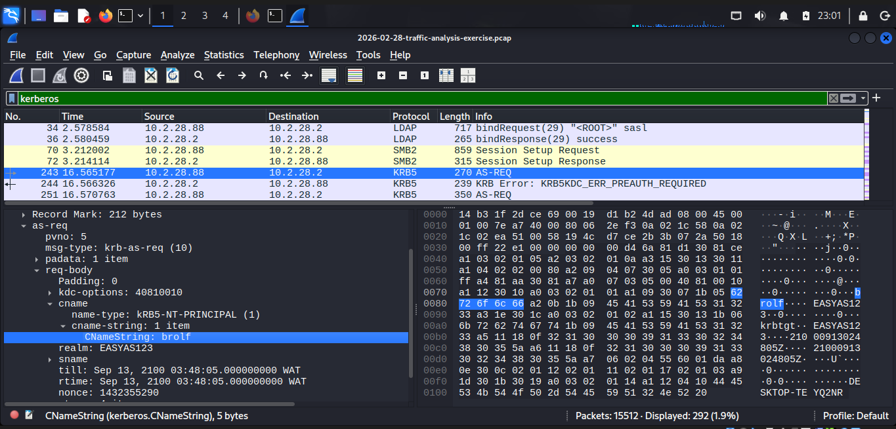

### Q5: Full name of the user tied to the account

Resolving a username to a full display name requires the **SAMR (Security Account Manager Remote Protocol)**, which carries structured account detail fields over RPC-over-SMB.

```
samr && ip.addr == 10.2.28.88
```

For precision, narrowing to the specific operation isolates the QueryUserInfo response directly:

```
samr.opnum == 36 && ip.addr == 10.2.28.88
```

The QueryUserInfo response contains a plaintext **Full Name** field.

**Finding: `Becka Rolf`**

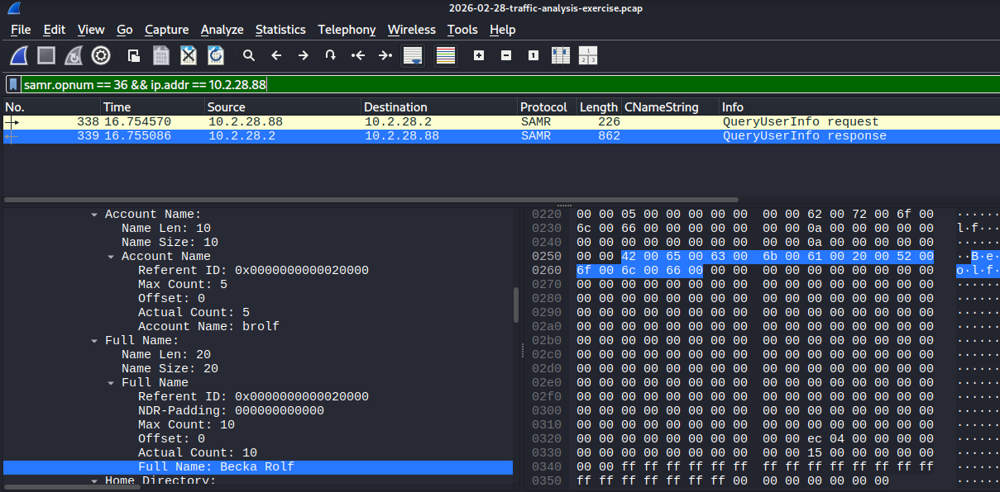

Together, these five findings give a SOC team everything needed to physically locate the infected machine, identify its user, and begin containment.

## Filter Reference / Methodology

The following filters were run to demonstrate core Wireshark investigative techniques, using the benign capture (`http_with_jpegs.cap`) as a baseline and the malicious capture for contrast.

### `http` show all HTTP traffic

This filter isolates packets that used the Hypertext Transfer Protocol.

On the benign capture, `10.1.1.101` is seen browsing to several different servers; `10.1.1.1` (an internal web server) and `209.225.0.6` / `209.225.11.237` (external). Response codes are clean `200 OK`, and content types match what's requested (`text/html`, `image/jpeg`).

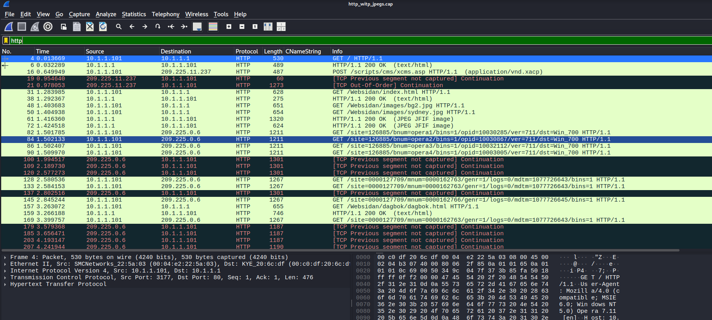

### `dns` show DNS queries/responses

On the benign capture, this filter returned **zero results**, indicating the recording window began after name resolution had already occurred, or the capture was trimmed to HTTP traffic only.

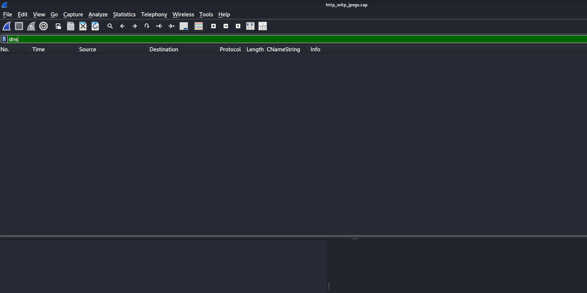

Running the same filter on the malicious capture tells a different story. The infected host's DNS behavior (SRV lookups, WPAD checks) is entirely consistent with normal domain operations, but the malicious C2 traffic to `45.131.214.85` **never appears anywhere in DNS**, because it's hardcoded by IP rather than resolved by domain name. This bypasses DNS-based detection entirely.

This kind of correlation (an outbound connection with no matching prior DNS query) is exactly the sort of check a SIEM should automate rather than rely on manual review. A viable detection rule to use is **alert when a host makes an outbound connection to an external IP with zero corresponding DNS query in the preceding time window.**

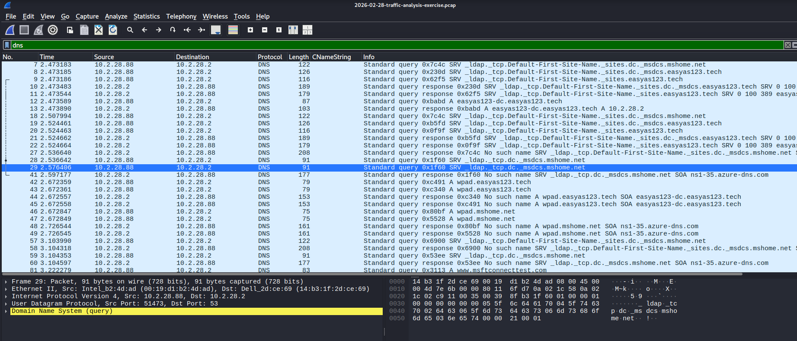

### `tcp.flags.syn==1` show SYN packets (connection attempts)

This filter shows all TCP connection attempts. Both SYN and SYN-ACK packets appear, since SYN-ACK also carries the SYN flag.

On the benign capture, nearly every SYN from `10.1.1.101` is immediately followed by a matching SYN-ACK (a successful, responsive connection). This is what normal browsing traffic looks like: request a resource, get a response, repeat.

SOC analysts isolate SYN packets not to read successful handshakes like this one, but to catch the **opposite pattern**; a flood of SYNs with no matching SYN-ACK response. That pattern can indicate a port scan (an attacker probing for open ports), a denial-of-service attempt, or malware trying to reach a C2 server that's been blocked by a firewall.

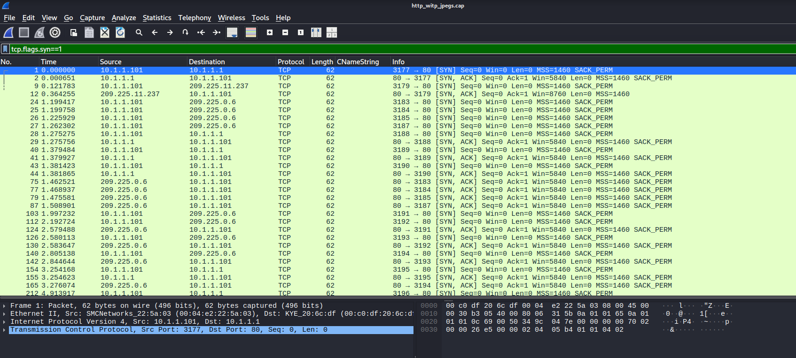

On the malicious capture, the same filter (narrowed to the C2 IP) shows just **one SYN and one SYN-ACK** for the entire session. The malware opens a single TCP handshake and reuses it for every beacon, using HTTP Keep-Alive to hold the socket open rather than tearing down and rebuilding a connection every 60 seconds. This is a stealthier pattern than repeated new connections would be. It blends in as one ordinary session instead of triggering a repeated-connection alert.

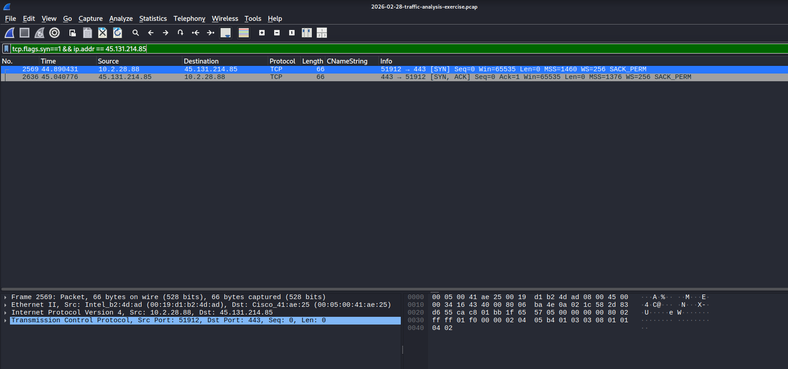

### `!(arp or dns or icmp)` — remove noise, show data traffic

The `!` operator negates the filter, showing everything captured **except** ARP, DNS, and ICMP traffic.

In practice, this filter mostly showed retransmission activity from an unrelated, healthy TLS connection to a CDN server. Not a clean list of only the suspicious traffic. This filter doesn't strip out retransmission noise, which can dominate the view when one connection experienced transmission problems during capture.

The key takeaway: this filter narrows **volume**, not **relevance**. A SOC analyst still needs context (the source of the alert, a known-bad IP) to identify which line in a "clean" filtered view actually matters.

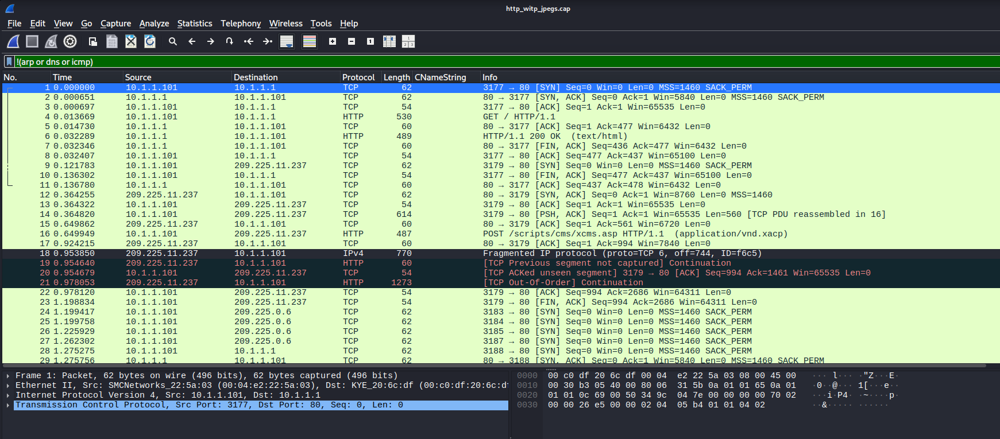

## OSI Layer Mapping

There are seven layers in the OSI model, but for packet analysis, only four come up in practice: Application, Transport, Network, and Data Link. Layers 5 (Session), 6 (Presentation), and 1 (Physical) rarely appear as distinct, separately-analyzable findings in a Wireshark capture.

**Layer 2 (Data Link): MAC address identification**
The infected host was identified via its Ethernet II source MAC (`00:19:d1:b2:4d:ad`) in DHCP and SMB2 packets, confirming the local network interface tied to the malicious traffic.

**Layer 3 (Network): IP-based pivoting**
The C2 IP (`45.131.214.85`) was used to pivot to the internal host it was communicating with (`10.2.28.88`). The core Layer 3 technique used throughout this investigation.

**Layer 4 (Transport): TCP handshake and connection behavior**
Analysis of the TCP three-way handshake (`tcp.flags.syn==1`) showed the C2 channel used a single persistent connection rather than repeated new connections, using HTTP Keep-Alive to maintain the session.

**Layer 7 (Application) — the bulk of the findings**
Kerberos revealed the username of the account on the affected system. The SAMR QueryUserInfo response revealed the full name (Becka Rolf) tied to that account. Nearly every substantive finding in this investigation (the C2 beacon pattern, the DNS evasion, the identity chain) lived at this layer, since Layers 2–4 mainly establish *that* a connection exists, while Layer 7 reveals *what the attacker is actually doing*.

## Conclusion / Recommendations

Based on these findings, the infected host `10.2.28.88` (`DESKTOP-TEYQ2NR`) should be contained immediately. User credentials for `brolf` should be revoked. The C2 IP address (`45.131.214.85`) must be blocked at the firewall to prevent further command-and-control communication. User awareness training is recommended for consideration as part of post-incident follow-up.
