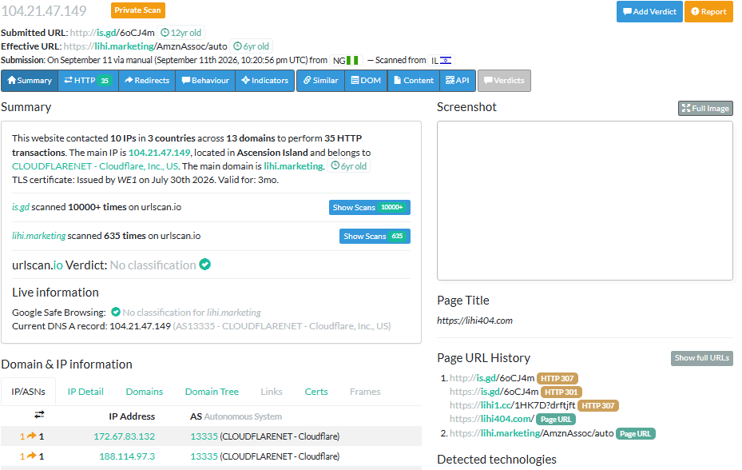
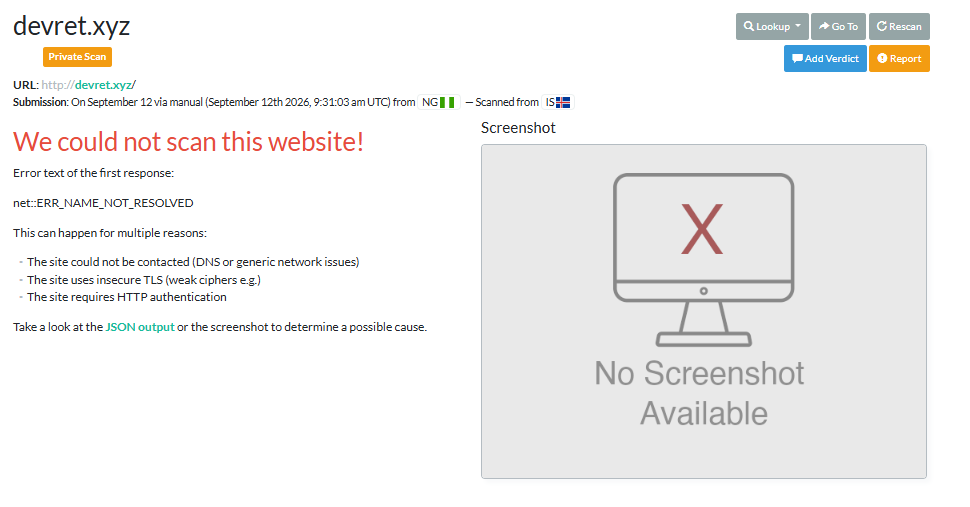

# Project 2.2: Phishing Email Analysis & Defence-in-Depth Playbook

## Executive Summary

This report analyses three sample emails from TryHackMe's "Phishing Emails in Action" room. The goal is to identify the IOCs in the sample emails. These emails impersonate trusted companies (PayPal, Netflix) just to exploit customers. The senders' domains for all of them are unrelated to the brand. The links in the emails had different outcomes; one sample's infrastructure is dead, one redirects elsewhere, one is attachment-based. This report contains IOC documentation and a Defence-in-Depth playbook addressing the technical and admin controls that are needed to mitigate the attacks.

Header analysis (sender IP, SPF/DKIM/DMARC verification) was out of scope for this report, as the TryHackMe samples used did not expose raw email headers.

## Samples Analysed

| Source | Task | Concept | Vector |
|---|---|---|---|
| TryHackMe: Phishing Emails in Action | Cancel Your Order | PayPal unauthorized charge | Shortened link |
| TryHackMe: Phishing Emails in Action | Track Your Package | Fake shipping notification | Direct link |
| TryHackMe: Phishing Emails in Action | Your Account Is on Hold | Netflix account suspension | PDF attachment |

## IOC Analysis Table

| Indicator | PayPal unauthorized charge | Package tracking | Netflix suspension |
|---|---|---|---|
| Sender (displayed name) | *PayPal / service@paypal[.]com* | Distribution Center / beginpro[.]club | "Netlix billing" / z99@musacombi[.]online |
| Sender (actual/spoofed domain) | *sultanbogor[.]com* | devret[.]xyz | musacombi[.]online |
| Suspicious URL(s) | is[.]gd/6oCJ4m (shortener, see Section 5) | devret[.]xyz (see Section 5, domain no longer resolves) | NA (attack vector is PDF, not a link) |
| Social engineering lever | Alarm (alerts customer to fake unauthorised charge) | Curiosity (informs customer about a fake tracking number) | Fear of loss of account |
| Generic greeting | Hello Customer (generic) | NA (email body not available) | Hello Customer (generic) |
| Mismatched domain (link text vs. actual destination) | Not a text/destination mismatch. Button links to a URL shortener (is[.]gd), obscuring the final destination | Has a text that directs user to a different destination from the sender's domain devret[.]xyz | NA (attacker uses PDF, not link) |
| Attachment type (if any) | NA | NA | PDF ("payment[...].pdf") |
| Email provider auto-detection | — | Auto-flagged as spam by domain provider; Yahoo | — |

## URL Analysis (URLScan.io)

### PayPal Phishing Mail

is.gd → is.gd (HTTPS) → lihi1.cc → final destination

At the time of analysis (September 2026), the shortened link no longer resolves to active phishing infrastructure. The is[.]gd redirect (originally part of a PayPal-impersonation training sample) now redirects to unrelated affiliate marketing content, consistent with shortener-link recycling/expiration over a multi-year period rather than active malicious hosting.

### Package Tracking Mail

URLScan.io was unable to resolve devret[.]xyz (`net::ERR_NAME_NOT_RESOLVED`), indicating the domain is no longer registered or has no active DNS record. This is consistent with the sample being retired training material rather than an active phishing campaign — the domain infrastructure has since been taken down or allowed to expire.

### Account Suspension Mail

No link was provided. The attack vector is a PDF, not a link. See Section 3 (IOC table).

## Findings Summary

The sample phishing emails in this analysis use different social engineering levers: PayPal unauthorized charge (alarm), package tracking (curiosity), Netflix suspension (fear). They also use three different delivery vectors; the unauthorised charge used a URL shortener, the package tracker used a direct suspicious link, and the suspension email used a PDF. These samples happen to demonstrate that there are various delivery vectors that can be used to exploit unsuspecting customers.

The two link-based samples pointed to sites that were no longer available at the time of this analysis. This shows that IOCs can go stale at any point in time. This is why it is important to always validate IOCs. The package tracker phishing email was flagged by the email domain provider, which is an illustration of email gateways as discussed in the Defence-in-Depth Playbook below.

## Defence-in-Depth Playbook

| Control Layer | Type | Control | What it would catch/stop |
|---|---|---|---|
| Email Gateway | Technical | Spam/phishing filtering, check sender authentication (SPF/DKIM/DMARC) | It would flag all three and move them to the spam folder. |
| MFA | Identity control | MFA on impersonated accounts. | Reduces the damage of leaked credentials. |
| User Awareness | Administrative | Security training on phishing mails | Would enable users to identify red flags in mails. |
| Endpoint | Technical | Antivirus, EDR, XDR scanning of mail attachments | It would scan the PDF in Sample 3 for malicious content. |
| SIEM Alerting | Technical and Detective | Noting inbound mail from new or low-authority domains. Alerting on outbound clicks to flagged URLs | Would reveal repeated phishing emails impersonating major brands. |
