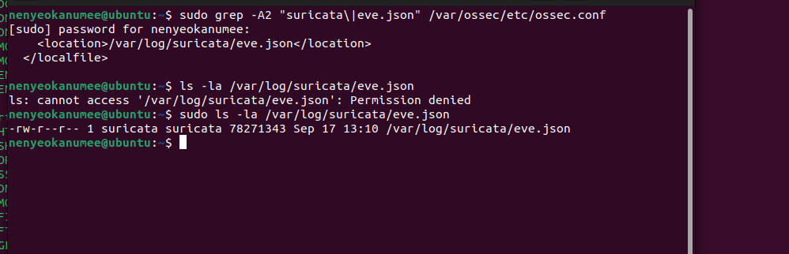
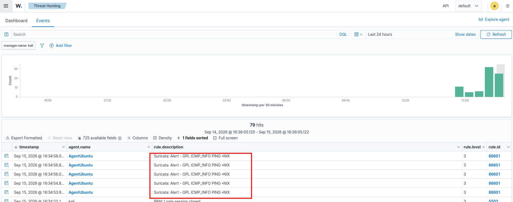
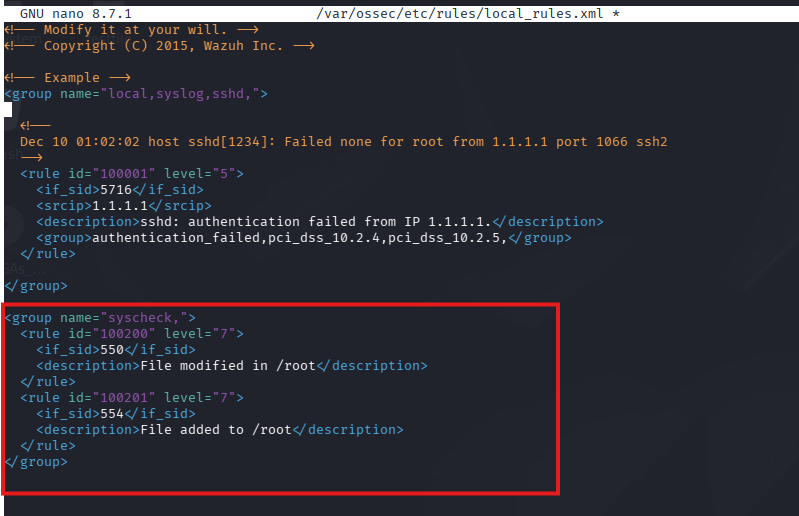
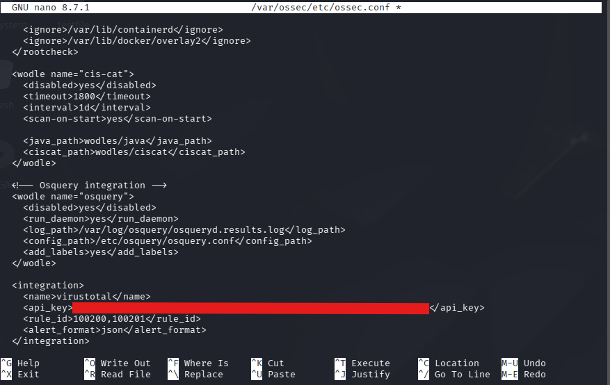
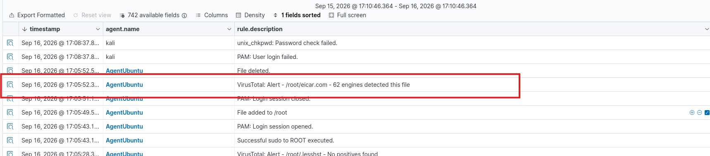
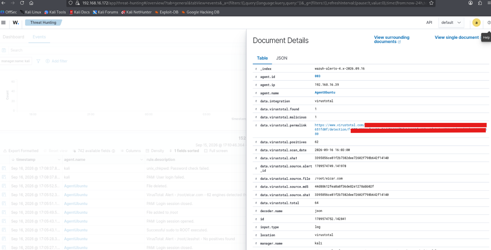

# Wazuh SIEM Home Lab: Deployment & Detection Engineering

## Executive Summary

This lab deploys Wazuh SIEM across three hosts (Kali Manager, Ubuntu Agent, Windows Agent). It showcases two working detection-and-response capabilities: Network Intrusion Detection using Suricata integrated with Wazuh, and file-based malware detection with automated response using File Integrity Monitoring (FIM), VirusTotal, and Active Response. Both detections are demonstrated with alert evidence.

## Environment

| Host         | Role                                        | OS         |
|--------------|---------------------------------------------|------------|
| Kali         | Wazuh Manager (indexer, dashboard, manager) | Kali Linux |
| AgentUbuntu  | Wazuh Agent + Suricata NIDS                 | Ubuntu     |
| AgentWindows | Wazuh Agent                                 | Windows    |

Wazuh Manager and agents communicate over the Wazuh agent protocol; Suricata runs locally on the Ubuntu agent and writes to `/var/log/suricata/eve.json`, which the Wazuh agent forwards to the manager for decoding and alerting.



Verification of the eve.json log path and Wazuh localfile config

*Figure 0 -* `ossec.conf`*'s* `<localfile>` *block confirms Wazuh reads from* `/var/log/suricata/eve.json`*;* `ls -la` *on the same path confirms Suricata is actively writing to it (78MB, timestamp matches lab activity).*

## Part 1: Deployment

1. Wazuh Manager is installed on Kali using the Wazuh download script (`wazuh-install.sh -a`), accessed over HTTPS on the manager's IP (`https://<ManagerIPAddress>`).
2. The Wazuh agents are deployed to the Ubuntu and Windows endpoints using the Wazuh Manager's 'Deploy new agent' wizard. This wizard generates a script or command that is used to install the Wazuh Agent on the endpoint.
3. `wazuh-manager`, `wazuh-indexer`, and `wazuh-dashboard` are required for Wazuh to start properly.

**Why this matters for a SOC role**

Ensuring that endpoints are enrolled, connected, and visible in the SIEM is an important operational task for a SOC analyst.

## Part 2: Network Intrusion Detection Engineering (Suricata)

Suricata is installed on Ubuntu. HOME_NET is configured for the Ubuntu host/network being monitored, with packet capture bound to the correct interface. Wazuh agent picks up Suricata logs via the `<localfile>` block and sends them to the Wazuh manager.

### Evidence



Wazuh Threat Hunting view showing Suricata alerts

*Figure 1 - Wazuh Threat Hunting → Events. Repeated* `Suricata: Alert - GPL ICMP_INFO PING *NIX` *entries confirm the Suricata → Wazuh JSON decoding pipeline is live.*

| Field            | Value                                                                      |
|------------------|-----------------------------------------------------------------------------|
| Rule description | `Suricata: Alert - GPL ICMP_INFO PING *NIX`                                |
| Rule ID          | 86601                                                                      |
| Rule level       | 3                                                                          |
| Agent            | AgentUbuntu                                                                |
| Volume           | 79 matching events were observed during the 24-hour dashboard time window. |

This confirms the system works: Suricata detects the event, the Wazuh agent picks up Suricata reports and sends them to the Manager, and the Manager generates a dashboard alert with a rule ID.

The observed alert is an ICMP packet generated by a ping. In this lab, the ICMP alert serves as a simple pipeline verification test rather than evidence of malicious activity.

## Part 3: File-Based Malware Detection + Automated Response (VirusTotal)

### What was built

Custom `local_rules.xml` rules configured for Wazuh file integrity monitoring (syscheck):



local_rules.xml syscheck rule definitions

*Figure 2 -* `/var/ossec/etc/rules/local_rules.xml`*, custom syscheck group.*

```xml
<group name="syscheck,">
 <rule id="100200" level="7">
   <if_sid>550</if_sid>
   <description>File modified in /root</description>
 </rule>
 <rule id="100201" level="7">
   <if_sid>554</if_sid>
   <description>File added to /root</description>
 </rule>
</group>
```

Wazuh already has rules 550 and 554 that detect file modifications or new file creation. We create our own rules that specifically watch for those events under /root. Each custom rule has its own ID. The VirusTotal integration is configured to watch for those custom rule IDs, so when one of those rules fires, Wazuh can send the file's hash to VirusTotal for checking.



VirusTotal integration block in ossec.conf

*Figure 3 -* `/var/ossec/etc/ossec.conf`*,* `<integration>` *block.*

The `<integration>` block sends events that match rule 100200/100201 to VirusTotal for hash verification. An Active Response script is configured to remove the file when the VirusTotal integration returns a positive malware detection.

### Evidence: Full detection-to-remediation chain



VirusTotal alert on EICAR test file

*Figure 4: Threat Hunting events log: file added to /root, VirusTotal alert (62 engines), file deleted, all within ~3 seconds.*

| Timestamp  | Event                                                                 |
|------------|-------------------------------------------------------------------------|
| 17:05:49.5 | File added to /root (EICAR test file)                                 |
| 17:05:52.3 | VirusTotal: Alert - `/root/eicar.com` - 62 engines detected this file |
| 17:05:52.5 | File deleted (automated response triggered)                           |



IOC details from the VirusTotal detection event

*Figure 5: Document detail view for the VirusTotal alert, showing hash values, engine count, and scan permalink.*

| Field        | Value                                      |
|--------------|---------------------------------------------|
| Source file  | `/root/eicar.com`                          |
| SHA1         | `3395856ce81f2b7382dee72602f798b642f14140` |
| MD5          | `44d88612fea8a8f36de82e1278abb02f`         |
| VT positives | 62 / 64 engines                            |

This provides a complete detect → analyze → contain chain supported by file hashes, the source path, VirusTotal results, and timestamps.

The detection-response chain executes immediately when the file enters the endpoint.

This demonstrates automated incident response: Wazuh detects the file, sends its hash to VirusTotal for analysis, and triggers an Active Response action to remove the file when a malicious detection is returned.

## Part 4: Key Takeaways

This lab demonstrates the deployment and operation of a multi-host Wazuh environment, including endpoint enrollment, Suricata network alert integration, File Integrity Monitoring, VirusTotal integration, and automated Active Response. The lab produced evidence at each stage of the detection pipeline, from network events and file creation to threat intelligence lookup and automated file removal. These capabilities demonstrate practical experience with SIEM monitoring, security alert analysis, IOC documentation, and automated incident response.
