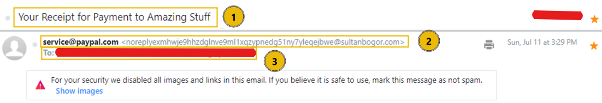
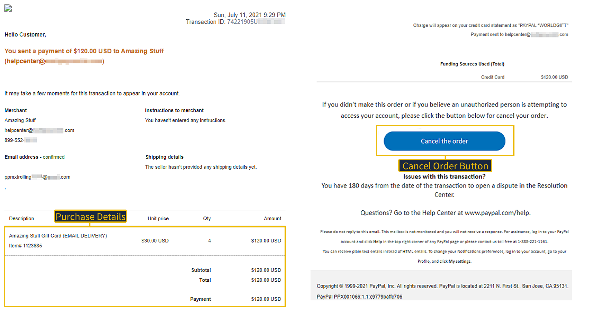

# NIST SP 800-61 Incident Response Report: Phishing-Triggered Credential Compromise — NovaBal Ltd

## 1. Incident Overview

Stephen Holjen, an accountant at NovaBal Ltd, received an email allegedly from PayPal on his corporate email telling him about an unauthorized charge he needed to attend to. He got the email on 11th July 2021 at 15:29hrs. Unfortunately, Stephen clicked on the link from his work laptop. This is a phishing-triggered credential compromise and should have a severity rating of critical because the user confirmed clicking the link and the account has moved past initial delivery into a confirmed compromise stage, with credential exposure risk to a corporate device given his role as an accountant with access to financial systems.

## 2. Preparation

Investigations show that the user does not have MFA enabled on his account. Also, it is confirmed that the email filtering control is inactive, as corporate mailboxes can receive mail from any domain. In addition, the yearly security awareness training has not been completed by over 60% of the staff strength in the organisation. Since the email filtering control was not active, there is no monitoring of emails. However, there is logging/monitoring for staff sign-ins. From what is gathered, there is no incident response plan for cases like this in the organisation.

## 3. Detection & Analysis

Stephen noticed that the link he clicked did not take him to PayPal and reported the issue to IT. Investigations show that the email claimed to be from service@paypal[.]com, but its spoofed domain is sultanbogor[.]com. It also contains a button labelled "Cancel the order", but buried under the button is a link shortener, is[.]gd/6oCJ4m, that redirects to lihi1[.]cc. The email raises alarm over an unauthorised charge on Stephen's PayPal account. It included a fabricated transaction receipt claiming a $120 charge processed at 9:29 PM that same evening, designed to create urgency.

There is no evidence of what was accessed and what wasn't, except for Stephen's email and the fact that the user clicked on the link in the email. However, the accountant's laptop has been exposed to attackers, so checks must be carried out to determine if there is any malware payload.

## 4. Containment

I recommend immediate containment of the account (disable the account and revoke all active sessions). Also, the sender domain should be blocked. I also recommend that the user's password be reset, mailbox rules be reviewed, and the endpoint be isolated.

Containment actions should be authorized by the SOC Team Lead and executed by the IT Service Desk, per the organization's escalation policy; account disablement and password reset require Team Lead sign-off given the Critical severity rating.

## 5. Eradication

All artifacts the attacker may have planted or gained were reviewed. The affected laptop should be reprovisioned. Stephen's mailbox was checked for a malicious forwarding rule; none was found. No unauthorized OAuth app grants found on the account. No malware payload identified. The attack was limited to link-based credential harvesting. Staff without MFA should be enrolled in MFA.

Users should be required to undergo security awareness training.

The root cause is that users are not properly educated on phishing emails and how to identify and handle them.

## 6. Recovery

Account should only be restored when MFA has been activated, and the user has passed security awareness training. The following steps were taken to confirm no residual access remained: sign-in logs were reviewed for anomalous location or device, no persistent mailbox forwarding rule was found, and active sessions were confirmed revoked.

Finally, monitor the account for the next quarter to confirm that the user is in line with the company's SOP on security.

## 7. Post-Incident Activity (Lessons Learned)

As detailed in Section 2, several control gaps allowed this attack to succeed. I recommend the following actions to mitigate these control gaps.

1. MFA should be compulsory for users.
2. Email filtering control should be activated.
3. Security awareness training should be mandated for staff.
4. Emails should be monitored on SIEM or XDR.
5. A comprehensive incident response plan should be put in place.

## 8. Appendix

### IOC Summary Table

| Indicator | PayPal Unauthorized Charge |
|---|---|
| Sender (displayed name) | PayPal / service@paypal[.]com |
| Sender (actual/spoofed domain) | sultanbogor[.]com |
| Suspicious URL(s) | is[.]gd/6oCJ4m (shortener — see Section 3) |
| Social Engineering Lever | Alarm (alerts customer to fake unauthorised charge) |
| Generic greeting | "Hello Customer" (generic) |
| Mismatched domain (link text vs. actual destination) | Not a text/destination mismatch. Button links to a URL shortener (is[.]gd), obscuring the final destination |

### Screenshots / Log Excerpts Referenced

**Email inbox — actual delivery timestamp (11 July 2021, 3:29 PM)**

**Fabricated transaction receipt inside the email body (claims 9:29 PM — part of the pretext, not the real incident time)**

